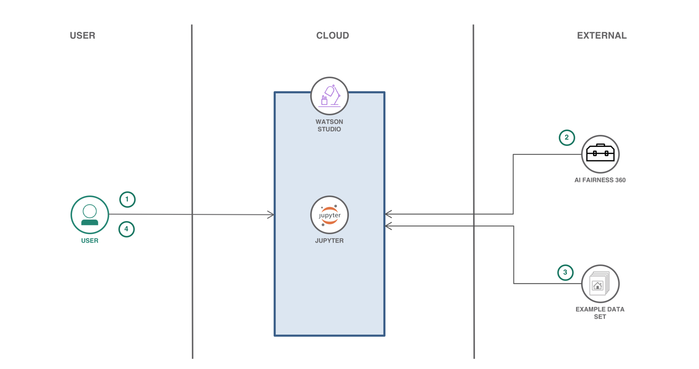
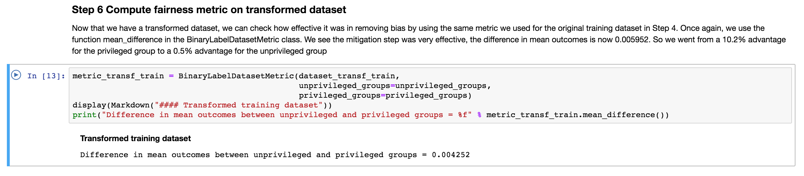

[](https://travis.ibm.com/samya/samya-bias-toolbox)

# Ensure Loan Fairness

A machine learning model makes predictions of an outcome for a particular instance. (Given an instance of a loan application, predict if the applicant will repay the loan.) The model makes these predictions based on a training dataset, where many other instances (other loan applications) and actual outcomes (whether they repaid) are provided. Thus, a machine learning algorithm will attempt to find patterns, or generalizations, in the training dataset to use when a prediction for a new instance is needed. (For example, one pattern it might discover is "if a person has salary > USD 40K and has outstanding debt < USD 5, they will repay the loan".) In many domains this technique, called supervised machine learning, has worked very well.

However, sometimes the patterns that are found may not be desirable or may even be illegal. For example, a loan repay model may determine that age plays a significant role in the prediction of repayment because the training dataset happened to have better repayment for one age group than for another. This raises two problems: 1) the training dataset may not be representative of the true population of people of all age groups, and 2) even if it is representative, it is illegal to base any decision on a applicant's age, regardless of whether this is a good prediction based on historical data.

AI Fairness 360 is designed to help address this problem with fairness metrics and bias mitigators. Fairness metrics can be used to check for bias in machine learning workflows. Bias mitigators can be used to overcome bias in the workflow to produce a more fair outcome.

When the reader has completed this Code Pattern, they will understand how to:

* Compute a fairness metric on original data using [AI Fairness 360](https://github.com/IBM/AIF360)
* Mitigate bias by transforming the original dataset
* Compute fairness metric on transformed training dataset



## Flow

1. User interacts with Watson Studio to create a Jupyter notebook
1. Notebook imports the AIF360 toolkit.
1. Data is loaded into the notebook.
1. User runs the notebook, which uses AIF360 tookit to assess fairness of Machine Learning model.

## Included components

* [Jupyter Notebook](http://jupyter.org/): An open source web application that allows you to create and share documents that contain live code, equations, visualizations, and explanatory text.
* [Tensorflow](https://www.tensorflow.org/): An open source software library for numerical computation using data flow graphs.
* [Watson Studio](https://www.ibm.com/cloud/watson-studio): Analyze data using RStudio, Jupyter, and Python in a configured, collaborative environment that includes IBM value-adds, such as managed Spark.

## Featured technologies

* [Artificial Intelligence](https://medium.com/ibm-watson): Artificial intelligence can be applied to disparate solution spaces to deliver disruptive technologies.
* [Data Science](https://medium.com/ibm-watson): Systems and scientific methods to analyze structured and unstructured data in order to extract knowledge and insights.
* [Python](https://www.python.org/): Python is a programming language that lets you work more quickly and integrate your systems more effectively.

# Steps

Either run locally:

1. [Clone the repo](#1-clone-the-repo)
2. [Run Jupyter Notebooks](#2-run-jupyter-notebooks)

or in Watson Studio:

3. [Sign up for the Watson Studio and Create a Project](#3-sign-up-for-watson-studio-and-create-a-project)
4. [Create the notebook](#4-create-the-notebook)

then:

5. [Run the Notebook](#5-run-the-notebook)

## Run locally

### 1. Clone the repo

Clone the https://github.com/IBM/ensure-loan-fairness-aif360 locally. In a terminal, run:

```
$ git clone https://github.com/IBM/ensure-loan-fairness-aif360
```

### 2. Run Jupyter Notebooks

The code included in this Code Pattern runs in a Jupyter Notebook.

* Start your Jupyter Notebooks. Starting in your `ensure-load-fairness-aif360` cloned repo directory will help you find the notebook and the output as described below. Jupyter Notebooks will open in your browser.

   ```
   cd ensure-load-fairness-aif360
   jupyter notebook
   ```

* Navigate to the `notebooks` directory and open the notebook file named `credit_scoring.ipynb` by clicking on it.

## Run in Watson Studio

### 3. Sign up for Watson Studio and Create a Project

* Sign up for IBM's [Watson Studio](https://dataplatform.ibm.com).
* Click the `Create a Project` tile and choose the `Data Science` tile by clicking `Create Project`. This is the best choice for a Jupyter notebook based project:


> Note: By creating a project in Watson Studio a free tier `Object Storage` service will be created in your IBM Cloud account. Take note of your service names as you will need to select them in the following steps.

> Note: When creating your Object Storage service, select the `Free` storage type in order to avoid having to pay an upgrade fee.

### 4. Create the notebook

* In [Watson Studio](https://dataplatform.ibm.com), click on `+ Add to project` and then click the `Notebook` tile.


* Select the `From URL` tab.
* Enter a name for the notebook.
* Optionally, enter a description for the notebook.
* Enter this Notebook URL: `https://raw.githubusercontent.com/IBM/ensure-loan-fairness-aif360/master/notebooks/credit_scoring.ipynb`
* For runtime choose `Default Python 3.5 Free (1 vCPU and 4 GB RAM)`.
* Click the `Create` button.


### 5. Run the Notebook

* Use the menu pull-down `Cell > Run All` to run the notebook, or run the cells one at a time top-down using the play button.

* As the cells run, watch the output for results or errors. A running cell will have a label like `In [*]`. A completed cell will have a run sequence number instead of the asterisk.

# Sample output

See `examples/example_notebook.ipynb`:



# Links

* [AI Fairness 360 Toolkit (AIF360)](https://github.com/IBM/AIF360)
* [Live Demo of AI Fairness 360](http://aif360.mybluemix.net/data#)
* [Contact AIF360 team on Slack](https://aif360.slack.com/)
* [IBM launches tools to detect AI fairness, bias and open sources some code](https://www.zdnet.com/article/ibm-launches-tools-to-detect-ai-fairness-bias-and-open-sources-some-code/)

# Learn more

* **Artificial Intelligence Code Patterns**: Enjoyed this Code Pattern? Check out our other [AI Code Patterns](https://developer.ibm.com/code/technologies/artificial-intelligence/).
* **Data Analytics Code Patterns**: Enjoyed this Code Pattern? Check out our other [Data Analytics Code Patterns](https://developer.ibm.com/code/technologies/data-science/)
* **AI and Data Code Pattern Playlist**: Bookmark our [playlist](https://www.youtube.com/playlist?list=PLzUbsvIyrNfknNewObx5N7uGZ5FKH0Fde) with all of our Code Pattern videos
* **With Watson**: Want to take your Watson app to the next level? Looking to utilize Watson Brand assets? [Join the With Watson program](https://www.ibm.com/watson/with-watson/) to leverage exclusive brand, marketing, and tech resources to amplify and accelerate your Watson embedded commercial solution.
* **Data Science Experience**: Master the art of data science with IBM's [Data Science Experience](https://datascience.ibm.com/)

# License
[Apache 2.0](LICENSE)
