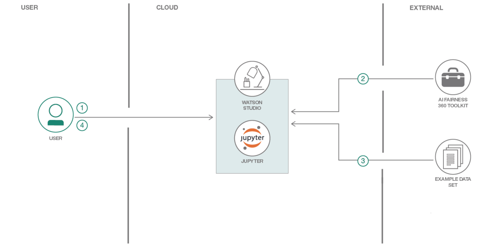

[](https://travis.ibm.com/samya/samya-bias-toolbox)

# samya-bias-toolbox
A toolbox for bias metrics, explanations, and remediation

When the reader has completed this Code Pattern, they will understand how to:

* [goal 1]
* [goal 2]
* [goal 3]
* [goal 4]



## Flow

1. User interacts with Jupyter Notebook.
2. Data is loaded into the notebook and used to create a Machine Learning scoring model.
3. The notebook uses Samya tookit to assess fairness of Machine Learning model.

## Included components

* [Jupyter Notebook](http://jupyter.org/): An open source web application that allows you to create and share documents that contain live code, equations, visualizations, and explanatory text.
* [Tensorflow](https://www.tensorflow.org/): An open source software library for numerical computation using data flow graphs.
* [Watson Studio](https://www.ibm.com/cloud/watson-studio): Analyze data using RStudio, Jupyter, and Python in a configured, collaborative environment that includes IBM value-adds, such as managed Spark.

## Featured technologies

* [Artificial Intelligence](https://medium.com/ibm-watson): Artificial intelligence can be applied to disparate solution spaces to deliver disruptive technologies.
* [Data Science](https://medium.com/ibm-watson): Systems and scientific methods to analyze structured and unstructured data in order to extract knowledge and insights.
* [Python](https://www.python.org/): Python is a programming language that lets you work more quickly and integrate your systems more effectively.

# Watch the Video

# Steps

## Run locally

1. [Clone the repo](#1-clone-the-repo)
1. [Run the notebook](#2-run-the-notebook)

### 1. Clone the repo

Clone the `xxxxxxxx` locally. In a terminal, run:

```
$ git clone https://github.com/IBM/xxxxxxxxxx
```

### 2. Run the notebook

The code included in this Code Pattern runs in a Jupyter Notebook.

* Start your Jupyter Notebooks. Starting in your `xxxxxxxxx` cloned repo directory will help you find the notebook and the output as described below. Jupyter Notebooks will open in your browser.

   ```
   cd xxxxxxxxx
   jupyter notebook
   ```

* Navigate to the `notebooks` directory and open the notebook file named `xxxxx.ipynb` by clicking on it.

  

* Use the menu pull-down `Cell > Run All` to run the notebook, or run the cells one at a time top-down using the play button.

* As the cells run, watch the output for results or errors. A running cell will have a label like `In [*]`. A completed cell will have a run sequence number instead of the asterisk.

# Sample output


# Links

# Learn more

* **Artificial Intelligence Code Patterns**: Enjoyed this Code Pattern? Check out our other [AI Code Patterns](https://developer.ibm.com/code/technologies/artificial-intelligence/).
* **Data Analytics Code Patterns**: Enjoyed this Code Pattern? Check out our other [Data Analytics Code Patterns](https://developer.ibm.com/code/technologies/data-science/)
* **AI and Data Code Pattern Playlist**: Bookmark our [playlist](https://www.youtube.com/playlist?list=PLzUbsvIyrNfknNewObx5N7uGZ5FKH0Fde) with all of our Code Pattern videos
* **With Watson**: Want to take your Watson app to the next level? Looking to utilize Watson Brand assets? [Join the With Watson program](https://www.ibm.com/watson/with-watson/) to leverage exclusive brand, marketing, and tech resources to amplify and accelerate your Watson embedded commercial solution.
* **Data Science Experience**: Master the art of data science with IBM's [Data Science Experience](https://datascience.ibm.com/)

# License
[Apache 2.0](LICENSE)
